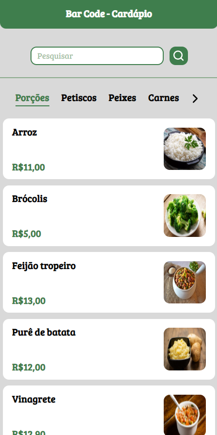
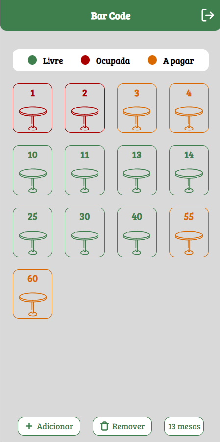
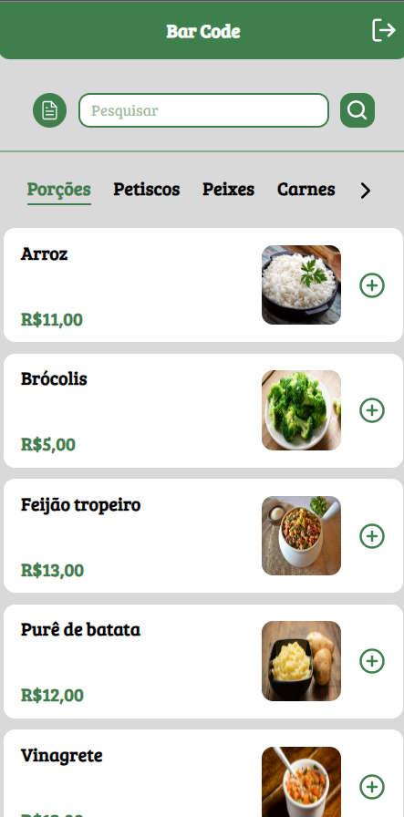
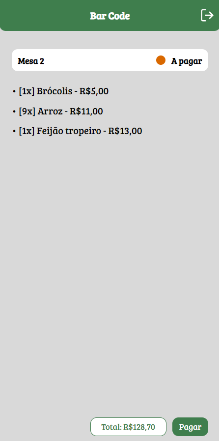
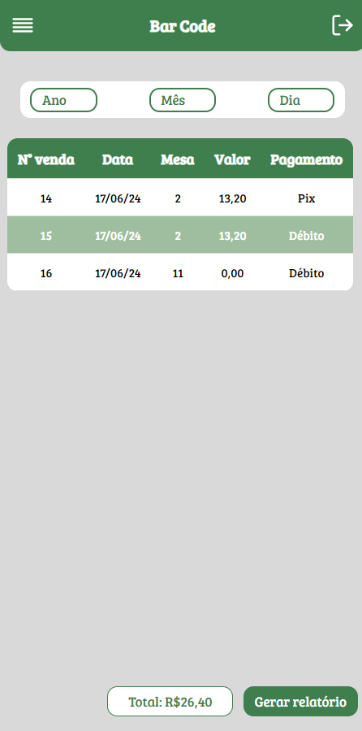
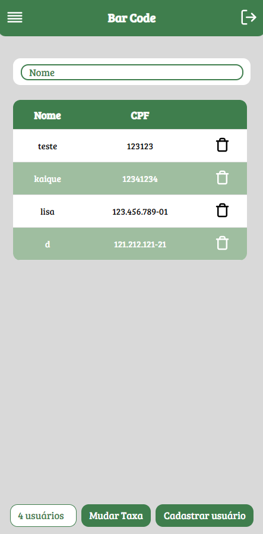
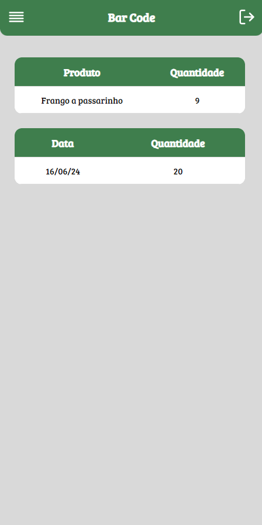

<h1 align="center"> BarCode (Bar e Restaurante) </h1>

Projeto feito para um trabalho da faculdade que consiste em gerenciar algum estabelecimento que lida com comidas e pessoas. (Escolhemos bar)  

 

  <h3>Tela Cliente</h3>
  

    
  

  <h3>Tela Garçons</h3>
  

    
    
  

  

    
  

  <h3>Tela Admin</h3>
  

    
    
  

  

    
  

## 🎓 Tecnologias

Esse projeto foi desenvolvido com as seguintes tecnologias:

- Angular e Spring Boot
- Java e TypeScript (+ JavaScript)
- Html e Css
- Figma
- Git e Github

## 📔 Contexto

Com o advento da tecnologia, até mesmo áreas que não têm uma ligação direta com as inovações precisam se
adaptar às novidades para se manterem firmes no mercado. Dessa forma, donos de estabelecimentos devem
utilizar um sistema para bares e restaurantes para atrair clientes e aumentar o seu faturamento.

Antes da integração com a tecnologia, bares e restaurantes controlavam os pedidos dos clientes por comandas,
o caixa recebia o pagamento em dinheiro. Mesmo que os computadores tenham chegado a alguns
empreendimentos, os donos contam com o trabalho manual para controlar a planilha de gastos, dinheiro recebido
e faturamento por mesa a fim de se calcular o valor de Ticket Médio que é um indicador de vendas que mostra
qual é a média de valor gasto por cada cliente/mesa que frequentou um estabelecimento em cada refeição
realizada em um determinado recorte de tempo.
Desta forma, é desejável a construção de um programa para a gestão eficiente do estabelecimento capaz de
automatizar diferentes áreas do segmento. Entre outras facilidades, um sistema desses permite:  
<ul>
    <li>Apresentar Cardápio do Restaurante;</li>
    <li>Mapa de mesas do Restaurante;</li>
    <li>Controle de Comanda por mesa; </li>
    <li>Fechamento de Comanda e Pagamento;</li>
    <li>Emissão de Relatórios Financeiro (vendas no período).</li>
</ul>

## 💌 Problema

Na dinâmica atual do mercado de bares e restaurantes, onde a eficiência e a rapidez são fundamentais para asatisfação do cliente e a rentabilidade do negócio, os sistemas integrados emergem como soluçõesindispensáveis. O Sistema BDV (Bom de Vendas) é fundamental para qualquer bar ou restaurante que busqueexcelência em atendimento e eficiência nas vendas.

Desta forma, este trabalho tem como objetivo a análise, modelagem e desenvolvimento de um sistema, capaz de registrar, acompanhar e gerenciar comandas de bares ou restaurantes, sendo capaz de gerenciar mesas do estabelecimento, registrando pedidos por mesa, realizando fechamento de comanda e por fim emite relatório de vendas por período.

Inicialmente, o sistema deverá apresentar o mapa das mesas disponíveis no estabelecimento. Cada mesa poderá ter os seguintes status: LIVRE, OCUPADA e AGUARDANDO_PAGAMENTO. A Figura 1 apresenta um exemplo de Tela de Mapa de Mesas. As mesas livres, numeradas, aparecem no sistema na cor verde. As mesas ocupadas recebem a cor vermelha e a cor laranja é dada às mesas que pediram o fechamento da conta, cujo pagamento ainda não chegou ao caixa.

Em seguida, para uma mesa livre, o sistema deverá realizar a abertura de uma mesa, modificando o número de ocupantes e já preenchendo automaticamente a data e horário de abertura da mesa, conforme apresentado de exemplo na Figura 2. Após realizar a abertura da mesa, o status da mesa deverá ser alterado para OCUPADO.

Para as mesas ocupadas, o sistema deverá ser capaz de apresentar o cardápio do estabelecimento que deverá ser composto pelos produtos vendidos pelo estabelecimento. Para tal, o sistema deve utilizar uma tabela de banco de dados nomeada “Produto” que armazena os dados dos produtos ofertados, tais como preço, descrição, categoria e imagem (que armazena a imagem do produto a ser apresentada em miniatura no cardápio). Após a apresentação do Cardápio, o sistema deverá ser capaz de registrar o Pedido do usuário, onde, após a seleção do Produto, deverá ser informada a quantidade de itens daquele produto. Este processo deverá ser repetido até o
usuário desejar encerrar o pedido, vale ressaltar que, o usuário poderá acrescentar pedidos a qualquer momento à mesa enquanto ela estiver com status de OCUPADA. A Figura 3 apresenta um exemplo de tela para acrescentar produtos ao pedido de uma mesa.

Em seguida, o fechamento da mesa ou comanda pode ser feita pelo seu número. Ao informar que deseja fechar a mesa, o sistema deverá apresentar os lançamentos realizados de forma que o usuário possa validar os produtos, quantidades e valores. Por fim, o sistema deverá apresentar o subtotal da compra ao realizar a soma dos valores de todos os produtos comprados, conforme ilustrado na Figura 4.

Ao fechar a comanda, o sistema deverá alterar o status da mesa para AGUARDANDO_PAGAMENTO. Desta
forma, ao clicar novamente sobre a mesa, o sistema deverá apresentar a tela de pagamento, onde é informado o subtotal, valor pago e a forma de pagamento (Cartão Crédito, Cartão Débito, PIX ou Dinheiro), conforme exemplificado na Figura 5. 

Após a realização do pagamento, o sistema deverá registrar a venda (salvando-a em uma tabela Venda) que deverá armazenar a mesa, o pedido (FK para tabela Pedido), o subtotal da venda, a forma de pagamento e registrar a data e hora do pagamento, e a mesa também deverá retornar seu status para LIVRE. A Figura 6 apresenta um exemplo de Tela que mostra todas as vendas registradas no sistema a fim de validar se a venda foi registrada corretamente.

Por fim, ainda na Tela de Registro de Vendas, o sistema deverá apresentar um botão para Gerar Relatório, que deverá apresentar um relatório de vendas por mesas ou por produtos (a ser escolhido pelo usuário) dentro de um período também escolhido pelo usuário, conforme apresentado na Figura 7. Além destes, o sistema também deverá apresentar um ranking com os produtos mais vendidos no bar/restaurante e os principais dias de vendas dentro do período selecionado, isto é, quais foram as datas com maior volume de vendas.

---

<h4 align="center">By: Isaluh - feat: Kaique, Augusto Lobo, Danilo Silva e Carlos Eduardo 🤍</h4>
